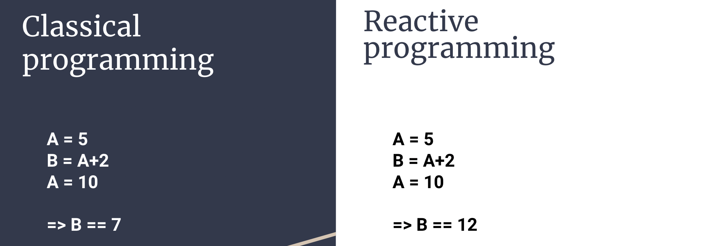

# reactive_lang

The objective of this project is the conception and creation of an inherently reactive programming language.
This means, changes to varibles also affect every variable that has been modified using said variable.

# Planned major features

[x] Creation of a Token list
[x] Creation of a basic Lexer
[ ] Creation of a Parser
[ ] Creation of an Interpreter
[ ] Extending the basic functionalities of the language
[ ] Web interfacing
[ ] Inbuilt-Database
[ ] SQL
[ ] Inbuilt Graph Library
[ ] Compiler
